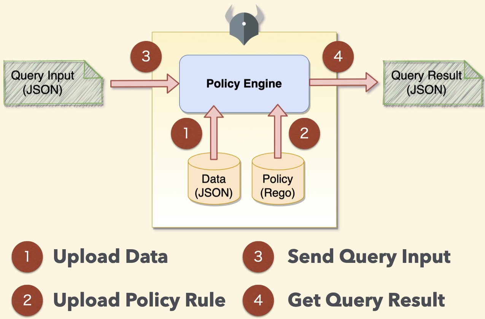

# opa-resful

[](https://github.com/go-training/opa-restful/actions/workflows/opa.yml)

## System Flow



## Integrating with the REST API

This document is the authoritative specification of the [OPA REST API](https://www.openpolicyagent.org/docs/latest/rest-api/).

### Run Open Policy Server

Run OPA server using the following command:

```sh
$ opa run --server
{"addrs":[":8181"],"diagnostic-addrs":[],"level":"info","msg":"Initializing server.","time":"2021-04-27T15:54:57+08:00"}
```

### Upload custom data

Uploading the role permission and group data:

```sh
curl -X PUT http://localhost:8181/v1/data/rbac/authz/acl --data-binary @data.json
```

See the data with `JSON` format:

```json
{
  "group_roles": {
    "admin": ["admin"],
    "quality_head_design": ["quality_head_design"],
    "quality_head_system": ["quality_head_system"],
    "quality_head_manufacture": ["quality_head_manufacture"],
    "kpi_editor_design": ["kpi_editor_design"],
    "kpi_editor_system": ["kpi_editor_system"],
    "kpi_editor_manufacture": ["kpi_editor_manufacture"],
    "viewer": ["viewer"],
    "viewer_limit_ds": ["viewer_limit_ds"],
    "viewer_limit_m": ["viewer_limit_m"],
    "design_group_kpi_editor": ["kpi_editor_design", "viewer_limit_ds"],
    "system_group_kpi_editor": ["kpi_editor_system", "viewer_limit_ds"],
    "manufacture_group_kpi_editor": ["kpi_editor_manufacture", "viewer"],
    "project_leader": ["viewer_limit_ds", "viewer_limit_m"]
  },
  "role_permissions": {
    "admin": [
      {"action": "view_all", "object": "design"},
      {"action": "edit", "object": "design"},
      {"action": "view_all", "object": "system"},
      {"action": "edit", "object": "system"},
      {"action": "view_all", "object": "manufacture"},
      {"action": "edit", "object": "manufacture"}
    ],
    "quality_head_design": [
      {"action": "view_all", "object": "design"},
      {"action": "edit", "object": "design"},
      {"action": "view_all", "object": "system"},
      {"action": "view_all", "object": "manufacture"}
    ],
    "quality_head_system": [
      {"action": "view_all", "object": "design"},
      {"action": "view_all", "object": "system"},
      {"action": "edit", "object": "system"},
      {"action": "view_all", "object": "manufacture"}
    ],
    "quality_head_manufacture": [
      {"action": "view_all", "object": "design"},
      {"action": "view_all", "object": "system"},
      {"action": "view_all", "object": "manufacture"},
      {"action": "edit", "object": "manufacture"}
    ],
    "kpi_editor_design": [
      {"action": "view_all", "object": "design"},
      {"action": "edit", "object": "design"}
    ],
    "kpi_editor_system": [
      {"action": "view_all", "object": "system"},
      {"action": "edit", "object": "system"}
    ],
    "kpi_editor_manufacture": [
      {"action": "view_all", "object": "manufacture"},
      {"action": "edit", "object": "manufacture"}
    ],
    "viewer": [
      {"action": "view_all", "object": "design"},
      {"action": "view_all", "object": "system"},
      {"action": "view_all", "object": "manufacture"}
    ],
    "viewer_limit_ds": [
      {"action": "view_all", "object": "design"},
      {"action": "view_all", "object": "system"}
    ],
    "viewer_limit_m": [{"action": "view_l3_project", "object": "manufacture"}]
  }
}
```

Try to fetch group roles data:

```sh
# curl tool
$ curl http://localhost:8181/v1/data/rbac/authz/acl/group_roles | jq
# or bat tool
$ bat GET http://localhost:8181/v1/data/rbac/authz/acl/group_roles
```

See the result:

```sh
$ curl http://localhost:8181/v1/data/rbac/authz/acl/group_roles | jq
  % Total    % Received % Xferd  Average Speed   Time    Time     Time  Current
                                 Dload  Upload   Total   Spent    Left  Speed
100   661  100   661    0     0   107k      0 --:--:-- --:--:-- --:--:--  107k
{
  "result": {
    "admin": [
      "admin"
    ],
    "design_group_kpi_editor": [
      "kpi_editor_design",
      "viewer_limit_ds"
    ],
    "kpi_editor_design": [
      "kpi_editor_design"
    ],
    "kpi_editor_manufacture": [
      "kpi_editor_manufacture"
    ],
    "kpi_editor_system": [
      "kpi_editor_system"
    ],
    "manufacture_group_kpi_editor": [
      "kpi_editor_manufacture",
      "viewer"
    ],
    "project_leader": [
      "viewer_limit_ds",
      "viewer_limit_m"
    ],
    "quality_head_design": [
      "quality_head_design"
    ],
    "quality_head_manufacture": [
      "quality_head_manufacture"
    ],
    "quality_head_system": [
      "quality_head_system"
    ],
    "system_group_kpi_editor": [
      "kpi_editor_system",
      "viewer_limit_ds"
    ],
    "viewer": [
      "viewer"
    ],
    "viewer_limit_ds": [
      "viewer_limit_ds"
    ],
    "viewer_limit_m": [
      "viewer_limit_m"
    ]
  }
}
```

### Upload policy data

```sh
curl -X PUT http://localhost:8181/v1/policies/rbac.authz --data-binary @rbac.authz.rego
```

See the rego data

```rego
package rbac.authz

import data.rbac.authz.acl
import input

# logic that implements RBAC.
default allow = false

allow {
  # lookup the list of roles for the user
  roles := acl.group_roles[input.user[_]]

  # for each role in that list
  r := roles[_]

  # lookup the permissions list for role r
  permissions := acl.role_permissions[r]

  # for each permission
  p := permissions[_]

  # check if the permission granted to r matches the user's request
  p == {"action": input.action, "object": input.object}
}
```

### Testing your input

Using [curl](https://curl.se/) tool.

```sh
curl -X POST http://localhost:8181/v1/data/rbac/authz/allow --data-binary @input.json
```

Using [bat](https://github.com/astaxie/bat) tool.

```sh
$ bat POST http://localhost:8181/v1/data/rbac/authz/allow < input.json
POST /v1/data/rbac/authz/allow HTTP/1.1
Host: localhost:8181
Accept: application/json
Accept-Encoding: gzip, deflate
Content-Type: application/json
User-Agent: bat/0.1.0


{"input":{"action":"edit","object":"design","user":["design_group_kpi_editor","system_group_kpi_editor"]}}


HTTP/1.1 200 OK
Content-Type: application/json
Date: Sat, 01 May 2021 08:43:30 GMT
Content-Length: 15


{
  "result": true
}
```

See the input data with `JSON` format.

```json
{
  "input": {
    "user": ["design_group_kpi_editor", "system_group_kpi_editor"],
    "action": "edit",
    "object": "design"
  }
}
```

or testing in golang:

```go
package main

import (
  "bytes"
  _ "embed"
  "fmt"
  "io/ioutil"
  "net/http"
  "time"
)

//go:embed input.json
var input []byte

func main() {
  url := "http://localhost:8181/v1/data/rbac/authz/allow"
  method := "POST"

  payload := bytes.NewReader(input)

  client := &http.Client{
    Timeout: 5 * time.Second,
  }
  req, err := http.NewRequest(method, url, payload)

  if err != nil {
    fmt.Println(err)
    return
  }
  req.Header.Add("Content-Type", "application/json")

  res, err := client.Do(req)
  if err != nil {
    fmt.Println(err)
    return
  }
  defer res.Body.Close()

  body, err := ioutil.ReadAll(res.Body)
  if err != nil {
    fmt.Println(err)
    return
  }
  fmt.Println(string(body))
}
```
